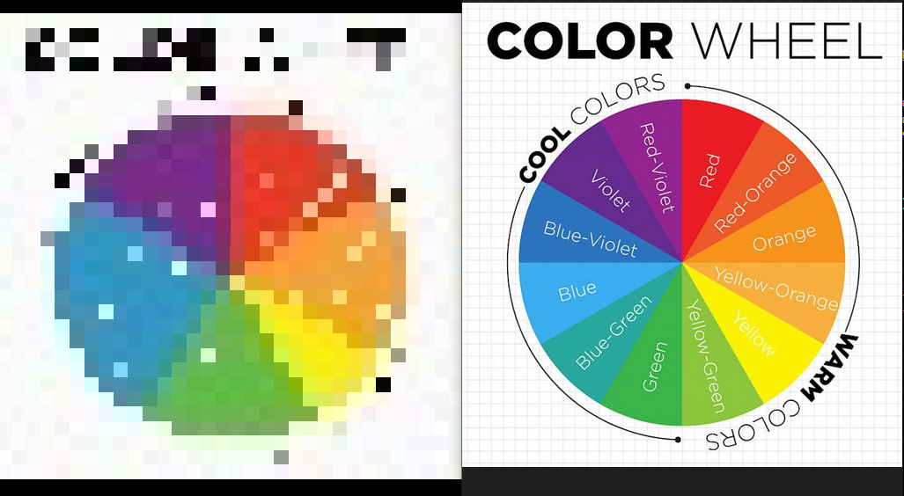

# Szükséges tudás
A programot pythonban készítettem el, mert a MATLAB-ot még nem használtam.
Utána kellett néznem az OpenCV működésének, azon belül ezekre volt szükségem:
-   kép beolvasás
-   felbontás átállítása, hogy pixeles legyen
-   kvantálás, hogy csak 16 színt tartalmazzon
-   k-means clustering OpenCV által, mert ez szükséges a kvantáláshoz

# Kép beolvasása
A képet amin teszteltem az **images** mappában helyeztem el, egy "red" feliratot ábrázol:


```
import cv2 as cv
img = cv.imread('.\images\Screenshot_3.png')
```

# Felbontás átállítása
A  OpenCV resize függvénye a kép felbontását az adott méretre változtatja.
```
    dimensions = (size, size)
    resized = cv.resize(frame, dimensions, interpolation)
```
Például ha 32-re szeretnénk csökkenteni a felbontást:


```
img_processed = cv.resize(img, (32,32), cv.INTER_NEAREST)
```
Ha pipelineként kezeljük és az előbbi képet ismét beadjuk a rescale függvénynek, visszanagyítva pl 300x300 pixelre, akkor jobban látható az eredmény.


```
img_processed2 = cv.resize(img_processed, (500,500), cv.INTER_NEAREST)
```
# Kvantálás

A kvantálás csökkenti a képen megjelenő különböző színek számát. Például egy szürkeárnyalatos 8bit-es kép 256 színéből néhány színt eggyé csoportosítunk. Erre nincsen dedikált OpenCV függvény, de k-means clusterezéssel megoldható.

## K-means Clustering

Eddig csak neurális hálókkal kapcsolatban használtam, de úgy tűnik bevett szokás színkvantálásra is használni, amit logikus ha a funkcionalitását tekintjük: Adott elemű csoportokra oszt és az egy csoportban lévő elemeken azonos műveleteket végez.

Az OpenCV 3D array-ként olvas be egy képet:
```
print(img.shape)    #(184, 201, 3)*
```
Tehát a teszt képem 184 sorból, 201 oszlopból és 3 csatornából (általában RGB, de OpenCv esetén BRG) áll. Ezt át kell konvertálni float 32 típusú 2D tömbbé a kmeans függvény számára.
```
two_d = np.float32( img.reshape((-1,3)) )
```

Ezután az átalakítás után a tömb minden sora egy pixelt reprezentál, az oszlopok pedig az adott pixel csatornáit. Ez a formátum szükséges, hogy a függvény elvégezhesse az euklideszi távolságszámolásait a csoportosításhoz.

-   centroid: a **k** db csoport **k** db színe.

A függvény minden pixelhez hozzárendeli a hozzá legközelebbi centroidot, majd újraszámolja a benne található színek átlagát és frissíti a centroidokat. 

Ezután definiálni kell egy leállási kritériumot. Én a dokumentációban ajánlott értékeket adtam meg, így akkor fog leállni az algoritmus ha eléri a 10 iterációt, vagy a centroidok változási rátája 1.0 alá kerül.
A kmeans függvény argumentumaiba megadom a tömböt és a kritériumot, emellett ami még fontos, hogy véletlenszerűen fogja a kezdő középpontot kiválasztani minden próbálkozásnál.3 eredményt ad, ezekből kettő fontos:

-   label: pixelek címkéje, melyik centroidhoz tartoznak
-   center: a csoportok centroidjai

```
criteria = (cv.TERM_CRITERIA_EPS + cv.TERM_CRITERIA_MAX_ITER, 10, 1.0)
_, label, center = cv.kmeans(two_d, 8, criteria, 10, cv.KMEANS_RANDOM_CENTERS)
```
Végül a center tömböt átkonvertáljuk 8bit-re (unit8) és az egyes pixelekhez hozzárendeljük a megfelelő középpontot a label segíségével.

```
center = np.uint8(center)
res = center[label.flatten()]
res2 = res.reshape((img.shape))
```
Az eredmény:


# Az **icon** függvény
A függvénynek argumentumként meg kell adni a képet, az elvárt felbontás méretét (mivel ikont csinál, így a szélesség és a magasság megegyezik) és az interpoláció fajtáját. Kipróbáltam párat és végül a **NEAREST** itnerpolációnál maradtam.

Az eredmény:


# Milyen képekből lesznek jó ikonok

## Színek

Teszteltem több színen a függvényt, az eredmények a resultsban láthatóak. Nem találtam kifejezett színt amire jobban vagy rosszabbul működne.

Viszont színkörön tesztelve az látszik, hogy a kvantálás miatt a színek elvesztették árnyalataikat, így egy olyan kép, aminek az információtartalmában nagy szerepet játszanak a rajta lévő árnyalatok nem lesz jó ikon.


## Részletgazdagság

Egy részletgazdag kép szintén elveszti az információtartalmát ikonként, így minél egyszerűbb képek kellenek.

## Források 
https://docs.opencv.org/


